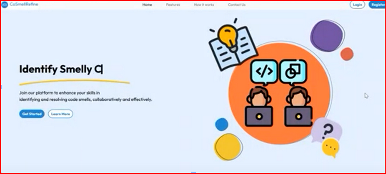
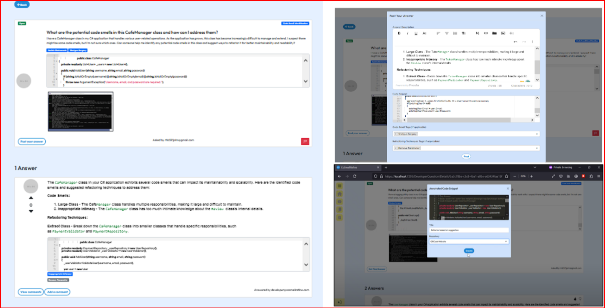
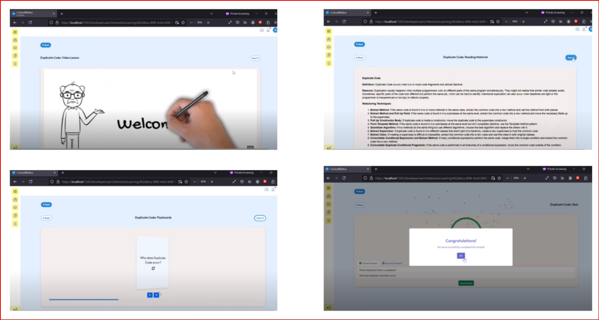

# **CoSmellRefine** : Integrating Cloud-based Crowdsourcing and Interactive Learning for Enhanced Code Smell Identification and Resolution

## Overview

CoSmellRefine is a web-based platform designed to optimize code smell identification and resolution through the integration of cloud-based crowdsourcing and interactive learning. The platform supports developers in collaborating on code review and refinement while learning about best practices in software development.


## Technologies Used
+ Technologies Used:

  + **ASP.NET Core MVC**: Backend web framework for building the application's core functionality.
  + **HTML, CSS, JavaScript**: Frontend technologies for crafting a responsive and user-friendly UI.
  + **jQuery & AJAX**: Enhancing dynamic interaction and asynchronous requests.
  + **Bootstrap**: For a responsive, mobile-friendly design.
  + **SQL Server**: Database for storing user data, code submissions, and feedback.
  + **SignalR**: Real-time communication for messaging and notifications.
  + **Azure**: Cloud platform for scalable resources.

   
## Features

+ Crowdsourced Code Review: Collaborate with peers to identify and resolve code smells.
+ Interactive Learning: Learn about common code smells and best refactoring practices.
+ Real-time Communication: Engage with other developers through SignalR-powered real-time messaging and notifications.


## Video Demonstration
Watch a detailed video demonstration of CoSmellRefine's features in action:
[Watch the video demonstration](https://shorturl.at/KOtIz)

## Screenshots

**Home Page**




**Crowdsourced Code Review**




**Interactive Learning**




## Installation & Setup

**To set up CoSmellRefine locally, follow these steps:**

1. Clone the repository:
```
git clone https://github.com/username/CoSmellRefine.git
cd CoSmellRefine
```

2. Set up the database:
Ensure SQL Server is installed and running. Update the appsettings.json file with your database connection string:

```
"ConnectionStrings": {
  "DefaultConnection": "Server=YOUR_SERVER;Database=CoSmellRefineDB;Trusted_Connection=True;"
}
```

3. Install dependencies:
Run the following command in the terminal to install the necessary packages:
```
dotnet restore
```

4. Run database migrations:
Apply the database migrations to set up the schema:
```
dotnet ef database update
```

5. Run the application:
Finally, run the application:
```
dotnet run
```

## Usage

+ Create an account to start submitting code snippets.
+ Submit code smells for peer review and feedback.
+ Learn and improve through interactive learning modules and feedback from the community.

## Contribution

Contributions are welcome! Feel free to fork the project, create a new branch, and submit a pull request.


## Contact Information

+ For any inquiries or further collaboration, feel free to reach out:

    + Email: shrirajan331@gmail.com
    + LinkedIn: [Shriraam Nagarajan](https://www.linkedin.com/in/shriraam-nagarajan-827b38198/)

Thank you for checking out this project!😊
